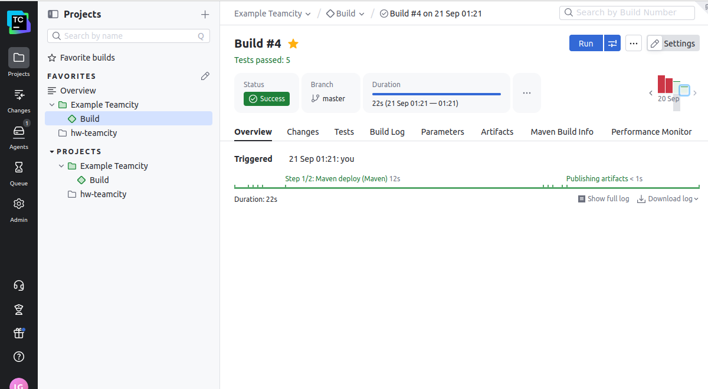
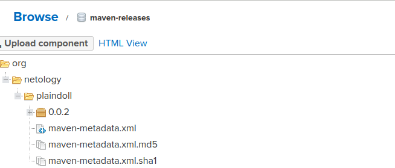
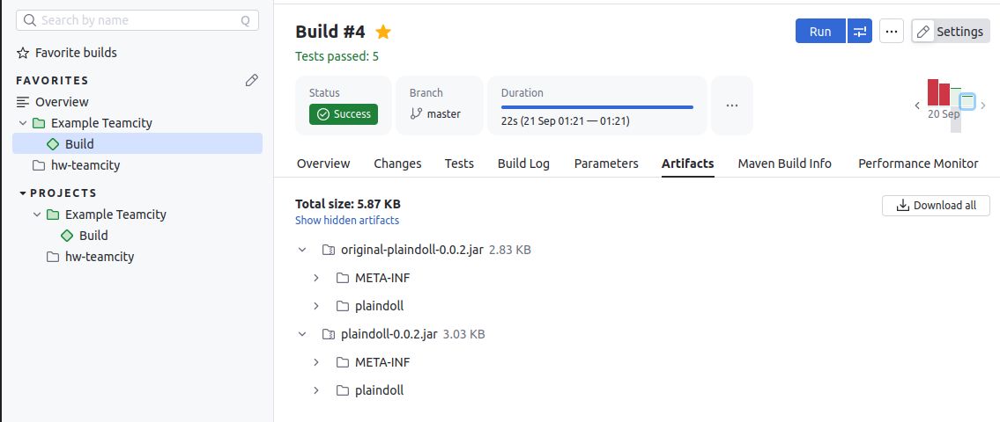
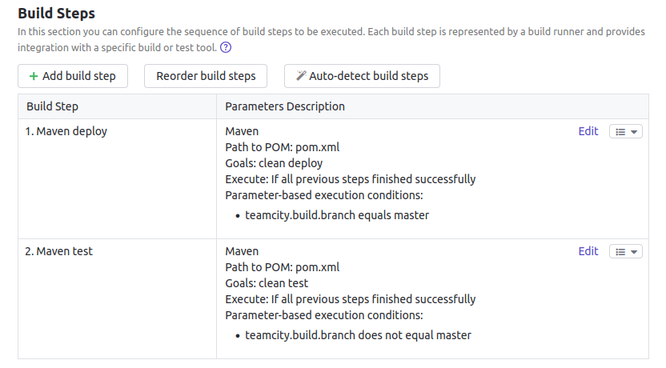
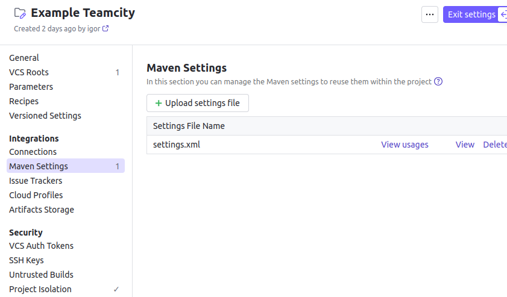
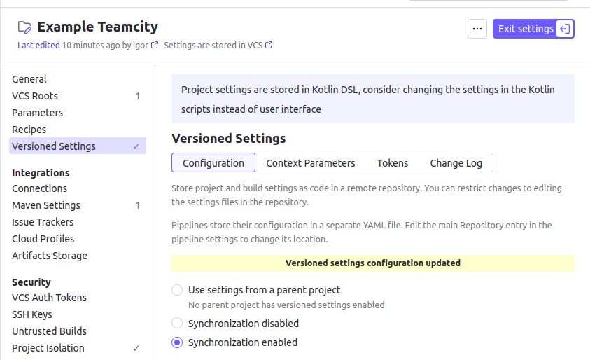
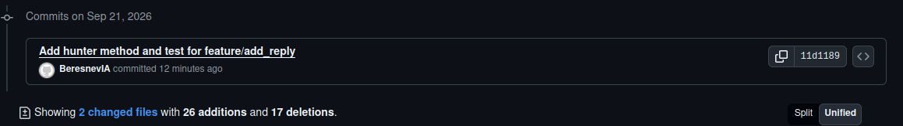

# Домашнее задание к занятию «Teamcity»
Выполнил: Береснев Игорь Андреевич

---

Создайте новый проект в teamcity на основе fork.
Сделайте autodetect конфигурации.
Сохраните необходимые шаги, запустите первую сборку master.
Поменяйте условия сборки: если сборка по ветке master, то должен происходит mvn clean deploy, иначе mvn clean test.
Для deploy будет необходимо загрузить settings.xml в набор конфигураций maven у teamcity, предварительно записав туда креды для подключения к nexus.
В pom.xml необходимо поменять ссылки на репозиторий и nexus.
Запустите сборку по master, убедитесь, что всё прошло успешно и артефакт появился в nexus.
Мигрируйте build configuration в репозиторий.
Создайте отдельную ветку feature/add_reply в репозитории.
Напишите новый метод для класса Welcomer: метод должен возвращать произвольную реплику, содержащую слово hunter.
Дополните тест для нового метода на поиск слова hunter в новой реплике.
Сделайте push всех изменений в новую ветку репозитория.
Убедитесь, что сборка самостоятельно запустилась, тесты прошли успешно.
Внесите изменения из произвольной ветки feature/add_reply в master через Merge.
Убедитесь, что нет собранного артефакта в сборке по ветке master.
Настройте конфигурацию так, чтобы она собирала .jar в артефакты сборки.
Проведите повторную сборку мастера, убедитесь, что сбора прошла успешно и артефакты собраны.
Проверьте, что конфигурация в репозитории содержит все настройки конфигурации из teamcity.
В ответе пришлите ссылку на репозиторий.

### Скриншот успешной сборки master

### Скриншот артефактов в Nexus

### Скриншот артефактов в TeamCity

### Скриншот условия по веткам

### Скриншот загруженного settings.xml

### Скриншот миграции конфигурации

### Скриншот коммита feature-ветки

